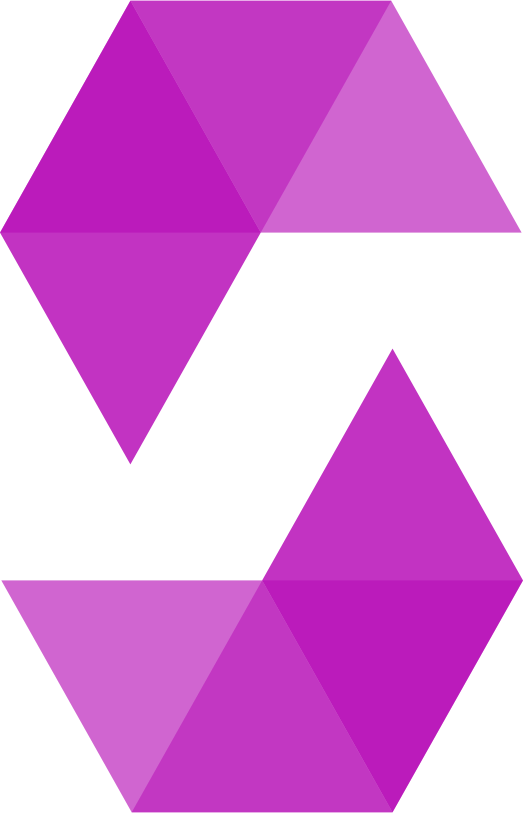

<h1 align="center">Hi 👋, I'm Saeed Aghamohammadi</h1>

<picture></picture> 

- 🔭 I’m currently working on **stock predicting, blockchain, and smart contracts.**

- 🌱 I’m currently learning **python, machine learning, CSS, HTML, and Solidity.**

- 👨‍💻 All of my projects are available at [https://github.com/Saeedam02](https://github.com/Saeedam02)

- 💬 Ask me about **solidity, Python,Matlab**

<h3 align="left">You Can Reach Me VIA:</h3>

<h3 align="left">Connect with me:</h3>

<!-- Tools and Languages -->
<h3 align="left">Languages and Tools:</h3>

<!-- OS -->
<!-- linux -->

<!-- Languages -->
<!-- Solidity -->

<!-- python -->

<!-- Matalb -->

<!-- Git -->

<!-- Foundry -->

<!-- Github Stats -->

  
  

