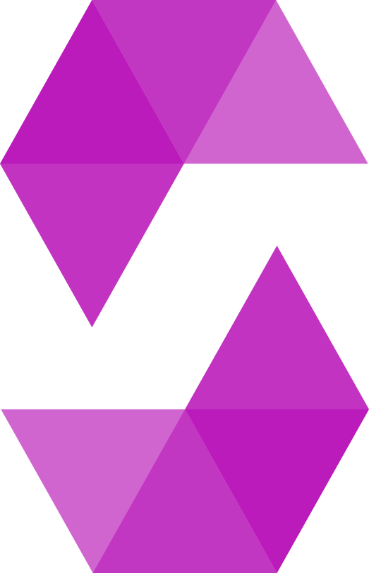
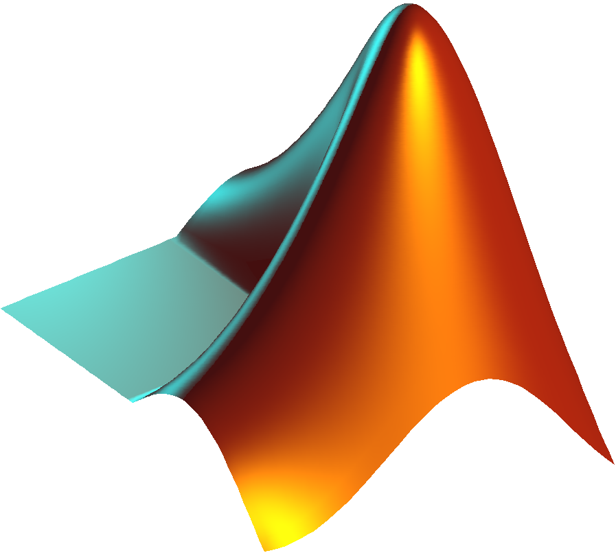

<h1 align="center">Hi 👋, I'm Saeed Aghamohammadi</h1>

<h3 align="center">Control Systems Engineer | Autonomous Vehicles & Automated Systems</h3>

  

---

### 🔬 Research Focus

I work on **control theory and automated systems**, with a particular interest in **autonomous vehicles** — from MIMO control design to embedded implementation. My MSc research (Amirkabir University of Technology) centered on multi-input multi-output control systems, and I build on that with hands-on work in Python, MATLAB/Simulink modeling and embedded C++ for real-time control applications.

- 🎓 **M.Sc, Control Systems Engineering** — Amirkabir University of Technology
- 🔭 Currently working on **autonomous vehicle control, Cyber-physical systems, and automated/embedded control systems**
- 🌱 Currently deepening my skills in **ML and Docker**
- 💬 Ask me about **autonomous vehicles, Control Algorithms, MATLAB/Simulink, embedded C++**
- 🎯 Open to **PhD positions and research collaborations** in control systems and autonomous/automated vehicle systems

---

<h3 align="left">You Can Reach Me VIA:</h3>

<h3 align="left">Connect with me:</h3>

<h3 align="left">Languages and Tools:</h3>

<!-- GitHub Overview -->

  

